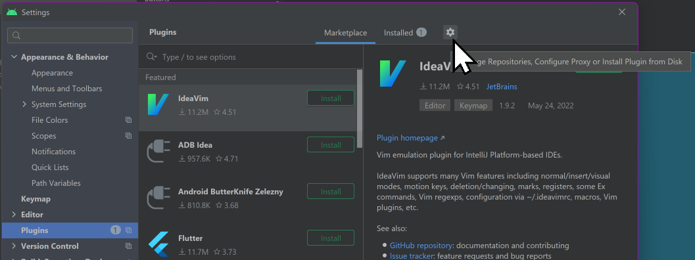
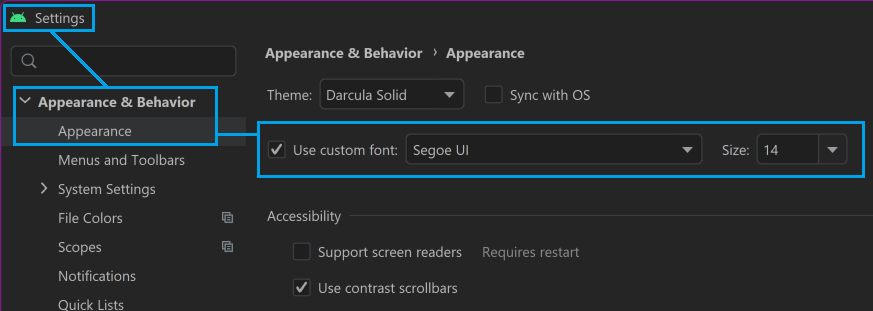

# Android Studio - Dark Mode

The "standard" dark mode that Android Studio uses has very low contrast. It's called "Darcula" but it's not the same as other software I've seen with a "Darcula" theme.

There is a built in "High contrast" mode, but it seems to have bad pixelation and is really too far in the other direction.

So I went to:

<https://plugins.jetbrains.com/plugin/13920-darcula-solid-theme/versions> and found a theme I preferred &mdash; `darcula-solid`. You download it, it's a jar file.

1. In Android Studio, open the **Settings** dialog (in the File menu) (also available by pressing `Ctrl` `Alt` `S`)
2. Select **Plugins** in the tree view on the left
3. Click the **gear icon** ⚙️ on the top of the dialog (see image)
	
4. Choose `Install Plugin` from Disk.
5. Locate the `.jar` file you downloaded.
6. Click `OK` to apply the changes and restart your IDE if prompted.

## Adust font size in Android Studio

To save my eyes (you generally only get the one pair) I also made the font size bigger.

This is under **Settings**  (in the **File** menu) (also available by pressing `Ctrl` `Alt` `S`) &mdash; **Appearance & Behavior** &mdash; Appearance. (See image)

