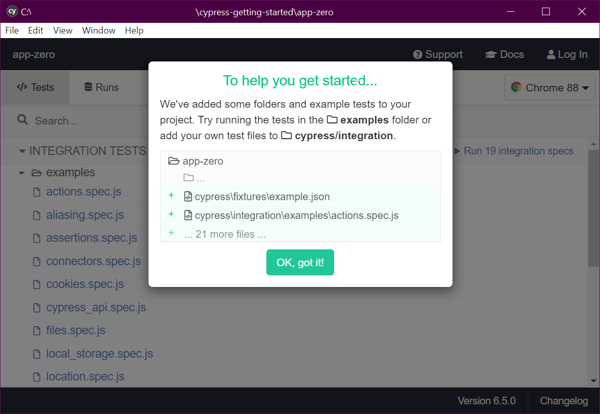
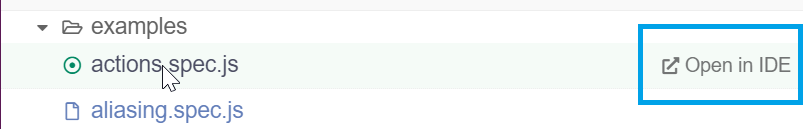
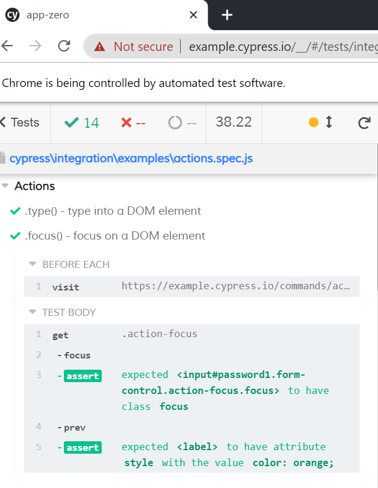
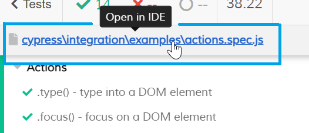
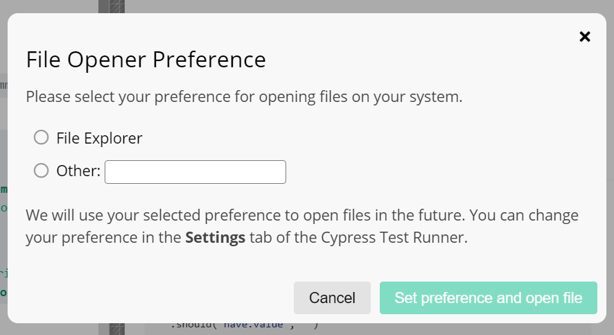

# Getting Started with Cypress

Cypress is a test framework that automates a chromium browser, to provide "end to end/integration" tests of your application.

(Back in the olden times I used "WatiN" for this - which was based on "WatiR". Selenium is a more famous example. Cypress goes a *lot* further.)

## Before we start

First create a new web project (unless you want to add cypress to an existing app... but I assume you're really "getting started".)

Start here:

	npm init

... and follow the prompts to create something. Anything. You'll see it's quite irrelevant, main thing is that you end up with a `package.json` file.

	yarn add cypress --dev

**or**

	npm install cypress --save-dev

... first time around the step above took me `461.55s`, second time it took `12.78s`

## Start Cypress

Open it with any of these:

	./node_modules/.bin/cypress open

**or**

	yarn run cypress open

**or**

	npx cypress open

I see this...

> It looks like this is your first time using Cypress: 6.5.0
>
> √  Verified Cypress! C:\Users\leonb\AppData\Local\Cypress\Cache\6.5.0\Cypress

It says "Try running the tests in examples folder" (we'll do that first)

and it further recommends "add your own test files to `cypress/integration`"

## 1. running the tests in examples folder

- I clicked `action.spec.js` and chose `open in IDE`

Windows Firewall warned me about an app trying to talk to the internet - I said "it's ok" and allowed it to proceed.

Now chrome starts up! Cool, and it says, in a banner "Chrome is being controlled by automated test software."

I see a test runner interface, wherein it's reported that `✔ 14` succeeded, and `❌ --` failed (which I take to mean "zero").

Expanding the second action I can see a `before each` section and a `test body`.

The steps within these is very readable, easy to inspect.

Next we'll look inside `action.spec.js` and see how it says this.

We could go and look for `action.spec.js` in the file system -- but look at this...

We can allegedly open it in the ide....

...On clicking that I get to configure the way this kind of file will be opened for inspection.

Ideally it would give you more choices, for example it should show `vs code` as an option for me since code is in my path variable.

## sidebar: trying to get it to load in `vs code`

I'll check that vs code is in the system `path`, not just "my user" `path`. (see [Environment variables -- view/edit them on windows](../windows/environment_variables.md)

Looks like I have it in the "user" section only under `C:\Users\MyUser\AppData\Local\Programs\Microsoft VS Code\bin`

- Before addressing that, per one of the guides online I tried restarting, to see if it was suddenly, magically listed there.

- That didn't work.

- Next I tried entering the full path to the executable into the file opener...

	"C:\Users\MyUser\AppData\Local\Programs\Microsoft VS Code\Code.exe"

I saw in the console it said:

	Could not open actions.spec.js in the editor.
	The editor process exited with an error: (code 1).

...now I went in to the settings, found the "File Opener Preference" and removed the double-quotes from around the value. Suddenly it worked! Ok... that was on me. Force of habit, that when a path contains spaces I surround it in double quotes.

I still don't know if making sure VS Code was re-installed to be available for "all users" *and* listed in the system `PATH`, would be enough to have it appear in the first place.

## Looking at `actions.spec.js`

Looking through actions.spec.js is *glorious*.

It's a tour of some basic actions, and how you specify them in `cy` language.

Here's a minimal test...

	context('Actions', () => {
		beforeEach(() => {
			/* do this each time... */
			cy.visit('https://example.cypress.io/commands/actions')
		})

		it('.type() - example of typing on into a DOM element', () => {
			// https://on.cypress.io/type
			cy.get('.action-email')
				.type('fake@email.com').should('have.value', 'fake@email.com')

			// now click the submit button...
			cy.get('#submit-button').click()

		})
	})

## Before adding our first test

Here is the structure of the files that cypress has added to our project...

- `cypress.json` (file) - configure cypress, by default this file is just `{}`
- `cypress/` (directory)
	- `fixtures/` (directory) - data used by our tests...
	- `integration/` (directory) - our *tests* go here
	- `plugins/` (directory) - plugins to enable extra functionality
	- `support/` (directory) - our *utils* and shared code go here

These are all things that we can edit/change and will learn to change.

## 2. add our own test files to `cypress/integration`

`todo` examples of our own tests. include assertions.

## External references

- [Installing cypress](https://docs.cypress.io/guides/getting-started/installing-cypress.html#System-requirements)
- [Writing Your First Test](https://docs.cypress.io/guides/getting-started/writing-your-first-test.html)
- [Testing Your App](https://docs.cypress.io/guides/getting-started/writing-your-first-test.html)

### Ancient Historical Journey

- [Watir](https://secretgeek.net/watir_3mins) - from 2006...

## See also

- [Node Package Manager -- some notes for beginners](../npm/getting_started.md)
- [npx - a fun and simple npm package runner](../npm/npx.md)
- [Install yarn on windows 2020](../yarn/install-yarn-on-windows-2020.md)
- [Environment variables -- view/edit them on windows](../windows/environment_variables.md)

