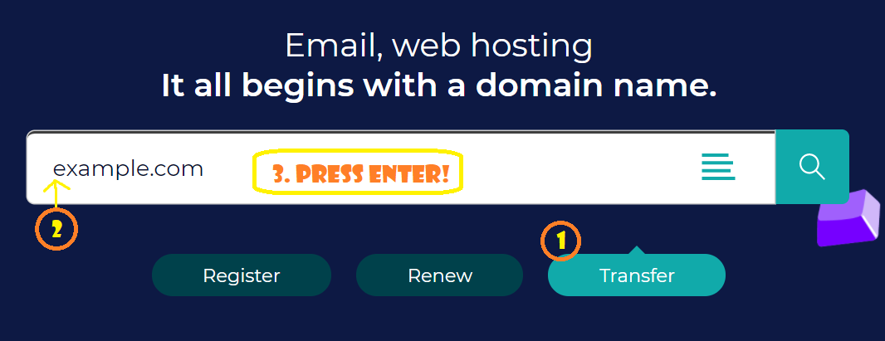
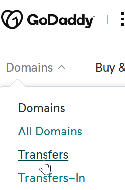
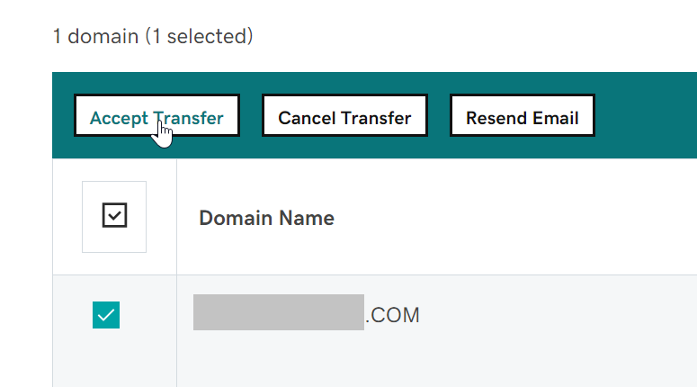
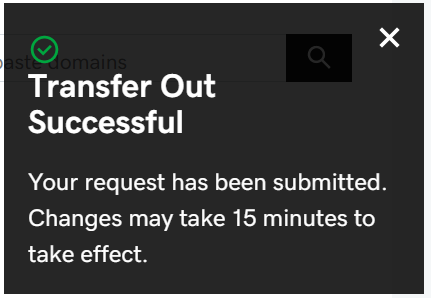

# Transfer Domain from godaddy to gandi

`note` You can't transfer a domain twice within 60 days.

## Initiate at the losing registrar (GoDaddy)

- Step 1. At GoDaddy -- click on your domains, click on the specific domain, that will take you to (for example...)

		https://dcc.godaddy.com/control/example.com/settings

	Scroll down to see that the admin details are correct (particular your email address, but all of the details.)

- Step 2. Scroll down to "Manage DNS" - make sure it only has name servers, and take note of what the name servers are. (i.e. make sure the DNS is handled at the host, or by a DNS specific server, not by go daddy)

		https://dcc.godaddy.com/manage/EXAMPLE.COM/dns?plid=1

	If it does have DNS details there (apart from nameservers) take notes of them, plus screenshots and definitely export them by using the "Export Zone File" link for your system (windows or linux)

- Step 3. On the previous page - the settings - just below the "manage DNS" link there is a link for "Transfer domain away from GoDaddy", for example:

		https://dcc.godaddy.com/control/EXAMPLE.COM/transferOut?plid=1

	...and click "continue with transfer"

- Step 4. On this new page you will click "continue with transfer" which will "[Unlock](https://en.wikipedia.org/wiki/Registrar-Lock)" your site, making transfer possible.

	Transfer also relies on having an `EPP` code, also known as an [Auth-Code, authorization code, transfer code, or Auth-Info Code](https://en.wikipedia.org/wiki/Auth-Code) (EPP stands for "Extensible Provisioing Protocol") which works as a shared secret between the registrars, providng that the gaining and receiving registrants are in agreement. (So do not disclose an EPP!)

	GoDaddy will email you telling you your site in unlocked. It will also emailing you giving you the `EPP`. (Though you can also copy the `EPP` off the page you are at.)

Now it's time to go the "Gaining registrar" (i.e. gandi) - and initiate the transfer there.

## Initiate at the gaining registrar (Gandi)

- Step 5. Go to [gandi.net](https://gandi.net) - the front page of the site - click the "transfer" button, enter your domain name (actually... copy paste it in -- don't type it!) and press enter.

	

- Step 6. It should say "Example.com can be transferred to Gandi." (if the Unlock has already been performed). Add it to your shopping cart, then go to your shopping cart.

- Step 7. Make sure the contact details look good, and are the contact details you want to use for this payment/transaction. (They do not have to be *identical* to the old details at the previous registrar and these are *not* the details that will be used for the domain registration itself... that's on the next screen), click `next` (or continue or whatever the button is)

- Step 8. Some DNS things... if the old registrar only had name-servers specified, then gandi will copy that in, and you're all good.

	For situations where the old registrar was looking after the DNS you have to start from scratch. I've clicked on the "Select a configuration template" and chosen "Gandi's default configuration" and then I plan to edit that *after* the transfer workflow is done. I have the copy of the zone file that I exported at **Step 2** above, and will use that to "eyeball it" and make sure I get everything right (it won't be identical to how it used to be... but it will be very similar in terms of CNames and A records).

- Step 9. Make sure you like the contact details. Note "Email address hidden" and "WHOIS privacy enabled".

- Step 10. Next screen -- here's where we enter the `EPP` which they refer to here as an `Authorization Code` -- enter that now!

	Also choose auto renew if you want that. I recommend it.

- Step 11. If everything loooks good proceed with Payment and confirmation.

## Accept the transfer at the losing registrar (GoDaddy)

- Step 12. You'll receive emails from Gandi confirming the purchase and from GoDaddy confirming that they've been asked to perform a transfer. Read the godaddy email carefully and you'll find you have two options: either wait 3 days for the process to be performed automatically - or immediately go to GoDaddy and confirm it.

	When logged in to GoDaddy, look at their main menu for the "transfers" link... and once there select "Transfers Out > To Another registrar"

	

	Here's the URL to confirm it:

		https://dcc.godaddy.com/transfers/out

	It will be a few minutes before the domain you are transferring turns up in that list. Spend this time nervously pacing around and assuming that your unlocked domain is now in the hands of a foreign organized criminal underground network. This is how I relax.

	Once it does show up and you select it and click "Accept transfer" you are DONE!

	

Look at this!

	

- Step 13. Now you have to make sure the DNS is all correct. Good luck with that!

	DNS used to scare me, but I like it now. *How did I get this way?*

## Appendix A: Godaddy's checklist

> 1. Make sure your administrative contact email is current. (It's where we send your transfer authorization code.)
> 2. Verify that the new registrar will set up your DNS zone files. If you don't do this, your website and email could go down.
> 3. Start the domain transfer at your new registrar. (We email you to ensure you requested the transfer.)
> 4. Authorize the transfer with your new registrar. (Use the transfer authorization code we email you when you're done here.)
> 5. We email you confirmation when your transfer completes, usually not more than 5-7 days.

## See also

- [Developing .net core app and deploying to linux at digital ocean](../linux/digital_ocean.md) - some DNS discussion here
- [Register a domain with zoho (aka DNS Text records at digitalocean such as DKIM)](../zoho/domain.md) - some DNS discussion here too.
