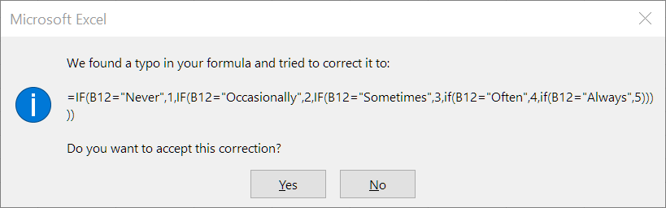

# Converting survey responses to numbers in excel

You've received a lot of survey data and it might have a column that says good, very good, poor etc -- and you want to turn it into numbers.

eg.

| Response | Value |
|-------|-------|
| Never | 1 |
| Occasionally | 2 |
| Sometimes | 3 |
| Often | 4 |

There's a bunch of different ways to solve this problem and they all look super nerdy.

Some nerds would say "use a Vlookup" and others would argue "use an index match" and others "use a switch function" -- all of these are powerful and fun and odd looking.

The "simplest" way is half as complex as those but still pretty nerdy.

Here's an example data - and what we want to achieve:

| + | 1 | 2 | 3 |
|---|----|----|---|
| A | **Person** | **Feeling** | **Score** |
| B | Maria | Sometimes |  |
| C | Jack| Never |  |
| D | Joan| Occasionally |  |
| E | Terry | Sometimes |  |
| F | Dave | Occasionally |  |

I wrote a "function" ---- a piece of text that starts with the equals sign '='

The function i wrote was this, i.e. here's what it says in `C2`:

	=IF(B2="Never",1,IF(B2="Occasionally",2,IF(B2="Sometimes",3,IF(B2="Often",4,IF(B2="Always",5)))))

It's a "nested if" function.

A "nested if" function is a function that is so ugly only it's mother could love it.

But because it's been around forever and because Excel will outlast everything else on earth -- it's not a bad investment of time to go through it super super slow, let it wash over you and begin to bask in its majesty.

We wrote that function in `C2`

When you copy and paste it from row 2 into row 3, excel magically rewrote all of the 2's into 3's ... and the function upfated for me.

(And sometimes you don't want it to do that -- there's a different trick to stop it from doing that.)

Also -- it is totally normal and expected that you'll get lost in all the commas and closing brackets..... you'll see this kind of error message at times:

I took a screenshot of that error when it happened to me earlier. I think i'd left out one of the ")" -- at the end ..... -- i just shared that so you know it's normal to get errors a lot.

90% of the books in computer science are about trying to re-think our lives such that we don't end up with complex nested if expressions.

Now you can use that function in all sorts of places, and if you take your time you can write them for any of these survey questions.
