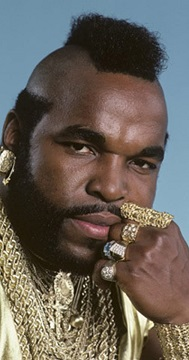

# Semantic HTML: Underused text-level elements

Here are some elements I don't use/consider enough.

These are just basic textual elements, not major structural pieces. (Ok, `figure` is structural, but not as major as section etc..)

## `<abbr>` - Abbreviation

- [abbr](https://developer.mozilla.org/en-US/docs/Web/HTML/Element/abbr)
- [Advanced text formatting: Abbreviations](https://developer.mozilla.org/en-US/docs/Learn/HTML/Introduction_to_HTML/Advanced_text_formatting#abbreviations)

## `<cite>` - Citations

- [cite: citation](https://developer.mozilla.org/en-US/docs/Web/HTML/Element/cite)

## `<dfn>` - Definition

## `<dl>`, `<dt>`, `<dd>` - Definition list, term and details

- [dl:Description List](https://developer.mozilla.org/en-US/docs/Web/HTML/Element/dl)
- [dt:Description Term](https://developer.mozilla.org/en-US/docs/Web/HTML/Element/dt)
- [dd:Description Details](https://developer.mozilla.org/en-US/docs/Web/HTML/Element/dd)
- [Advanced text formatting: Description Lists](https://developer.mozilla.org/en-US/docs/Learn/HTML/Introduction_to_HTML/Advanced_text_formatting#description_lists)

## `<figure>` - Figure with Captions

- [figure: figure with optional caption](https://developer.mozilla.org/en-US/docs/Web/HTML/Element/figure)

Example:

	<figure>
	
	<figcaption>This is Mr. T</figcaption>
	</figure>

<figure>

<figcaption>This is Mr. T</figcaption>
</figure>

It took me quite a while to find CSS that would do what I wanted for the `figure/img/figcaption` combo above.

Given that I was already centering my images, with something like this:

	img {
		max-width: calc(100% - 30px);
		margin: 15px auto;
		display: block;
	}

I wanted to have the `figure` provide a border, be centered, and *not* be full-width, and for the `figcaption` to be centered under the `img`.

	figure {
		margin: 0 auto;
		border: 1px solid var(--table-border);
		width: max-content;
	}

	figcaption {
		margin: 15px auto;
		text-align: center;
	}

## `<mark>` - Mark

- [mark: Mark Text Element](https://developer.mozilla.org/en-US/docs/Web/HTML/Element/mark)

Rather than `highlighted text` - use `<mark>highlighted text</mark>`

Let me mark a few <mark>choice phrases</mark> in this <mark>fascinating</mark> sentence.

### Indicating `<mark>` in markdig markdown

According to [markdig test on 'emphasis'](https://github.com/xoofx/markdig/blob/master/src/Markdig.Tests/Specs/EmphasisExtraSpecs.md) we can use `==equals==` to indicate the text to ==mark up==.

## `<q>` - Inline Quotation

- [q: inline quotation](https://developer.mozilla.org/en-US/docs/Web/HTML/Element/q)

The inline complement to `blockquote`, for times when a quotation does not receive its own block.

	
Mr. T says <q cite='https://en.wikipedia.org/wiki/I_Pity_the_Fool_(TV_series)'>I pity the fool</q>

Mr. T says <q cite='https://en.wikipedia.org/wiki/I_Pity_the_Fool_(TV_series)'>I pity the fool</q>

There are probably quotes around that, provided by the user-agent stylesheet, via a `q::before { content: open-quote }` (and ... `close-quote`). [Some CSS-Tricks info about that](https://css-tricks.com/almanac/properties/q/quotes/)

`tip` The `quote` element should be used for <em>literal</em> quotes, not for decorative purposes such as "sarcasm", "air-quotes" and other rhetorical instances. (i.e. use it to for <em>literal</em> quotes, but not for "literal" quotes.)

(There is no `<sarcasm>` element. Or rather: `<sarcasm>`There <em>is</em> a sarcasm element`<sarcasm>`. [w3c disccusion here](https://lists.w3.org/Archives/Public/public-html/2014Nov/0007.html))

## `<time>` - Time element

- [time: Time element](https://developer.mozilla.org/en-US/docs/Web/HTML/Element/time)

Example:

	<time datetime="2021-02-22">22 February 2022</time>
	<time datetime="2021-02-22T19:30+01:00">7.30pm, 22 February 2021 is 8.30pm in France</time>

## Sources

At [developer.mozilla.org](developer.mozilla.org):

- [abbr](https://developer.mozilla.org/en-US/docs/Web/HTML/Element/abbr)
- [Advanced text formatting: Abbreviations](https://developer.mozilla.org/en-US/docs/Learn/HTML/Introduction_to_HTML/Advanced_text_formatting#abbreviations)
- [cite: citation](https://developer.mozilla.org/en-US/docs/Web/HTML/Element/cite)
- [dl:Description List](https://developer.mozilla.org/en-US/docs/Web/HTML/Element/dl)
- [dt:Description Term](https://developer.mozilla.org/en-US/docs/Web/HTML/Element/dt)
- [dd:Description Details](https://developer.mozilla.org/en-US/docs/Web/HTML/Element/dd)
- [Advanced text formatting: Description Lists](https://developer.mozilla.org/en-US/docs/Learn/HTML/Introduction_to_HTML/Advanced_text_formatting#description_lists)
- [figure: figure with optional caption](https://developer.mozilla.org/en-US/docs/Web/HTML/Element/figure)
- [mark: Mark Text Element](https://developer.mozilla.org/en-US/docs/Web/HTML/Element/mark)
- [q: inline quotation](https://developer.mozilla.org/en-US/docs/Web/HTML/Element/q)
- [Css-Tricks: quotes](https://css-tricks.com/almanac/properties/q/quotes/)
- [time: Time element](https://developer.mozilla.org/en-US/docs/Web/HTML/Element/time)

## See also

- [Making Expando/Accordian with Plain Html](expando_accordian_with_html.md) featuring `
`/`
`
