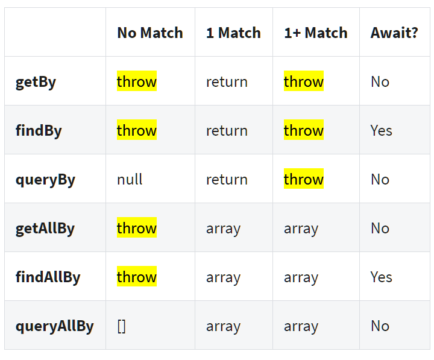

# tips n tricks with jest testing (of react)

## Only and Skip

You have a `.test.tsx` file with many tests, they all start like this...

	test("Laser guidance", async () => {
	test("Laser cooling", async () => {
	test("Laser calibration", async () => {

You want to run just 1 test? Change it to use `test.only`...

	test.only("Laser guidance", async () => {
	test("Laser cooling", async () => {
	test("Laser calibration", async () => {

You can also use this to run more than one. The `.only` does *not* need to be exclusive

	test.only("Laser guidance", async () => {
	test.only("Laser cooling", async () => {
	test("Laser calibration", async () => {

And you could instead use `.skip` to avoid the one you don't want...

	test("Laser guidance", async () => {
	test("Laser cooling", async () => {
	test.skip("Laser calibration", async () => {

## wait for the whole render

There might be race conditions in your render that you're not able to fix right now, and which result in intermittent failures, i.e. flaky tests.

wrap the render in an `act` so that the whole thing really must finish before the test proceeds...

	await act( async () =>  render(routerWrapper(employeeWrapper(<EmployeeProfile />))));

...this will cause a warning.

## screen debug

You can output/log what the `screen` holds with `screen.debug`

## get/find/query -- which is what?

&mdash;[source - '#Queries' in cheatsheet](https://testing-library.com/docs/react-testing-library/cheatsheet#queries))

## Sources

- [React Testing Library](https://testing-library.com/docs/react-testing-library/intro/)
- [Query (get/find/query)](https://testing-library.com/docs/react-testing-library/cheatsheet#queries)

