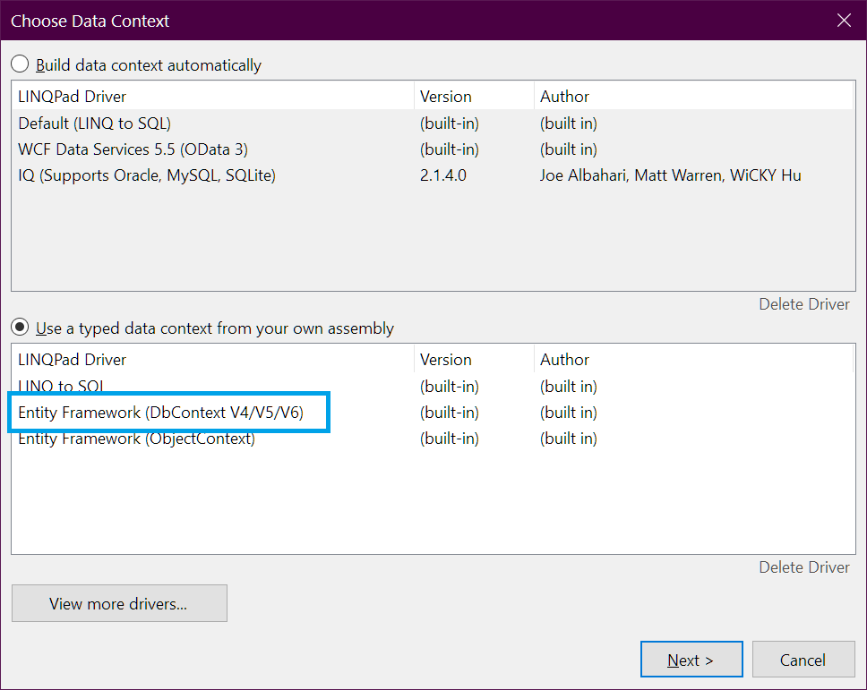

# Play with Entity Framework 6 from Linqpad

In short:

- add a connection

Choose "Use a typed context from your own assembly"

...with "Entity Framework (DbContext V4/V5/V6)"

(Nearby possibilities include: [adding access to Oracle, MySQL, SQLite](connect_to_oracle.md)... i might prefer that. How about interoperable python-based data providers?)

## Sources

- https://www.linqpad.net/EntityFramework.aspx
- https://www.syncfusion.com/succinctly-free-ebooks/getting-the-most-from-linqpad-succinctly/linqpad-and-entity-framework
