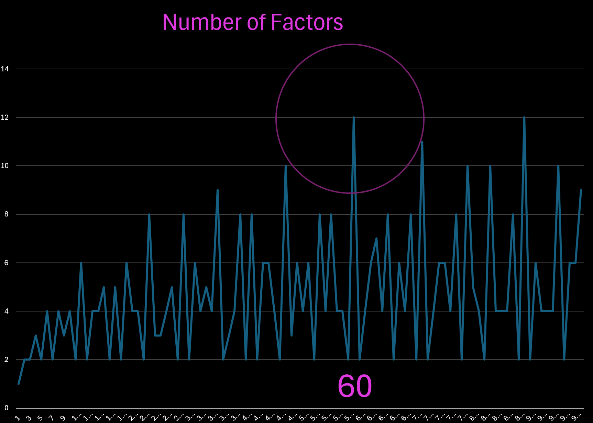

# Factors

To understand the above graph, here is a complete accounting of the factors of each numbers from 1 to 100

| Number :| FactorsCSV :| Count(Factors) :| % Factors |
|---------|-------------|-----------------|-----------|
| 1 | 1 | 1 | 100% |
| 2 | 1,2 | 2 | 100% |
| 3 | 1,3 | 2 | 66.66666666666667% |
| 4 | 1,2,4 | 3 | 75% |
| 5 | 1,5 | 2 | 40% |
| 6 | 1,2,3,6 | 4 | 66.66666666666667% |
| 7 | 1,7 | 2 | 28.571428571428573% |
| 8 | 1,2,4,8 | 4 | 50% |
| 9 | 1,3,9 | 3 | 33.333333333333336% |
| 10 | 1,2,5,10 | 4 | 40% |
| 11 | 1,11 | 2 | 18.181818181818183% |
| 12 | 1,2,3,4,6,12 | 6 | 50% |
| 13 | 1,13 | 2 | 15.384615384615385% |
| 14 | 1,2,7,14 | 4 | 28.571428571428573% |
| 15 | 1,3,5,15 | 4 | 26.666666666666668% |
| 16 | 1,2,4,8,16 | 5 | 31.25% |
| 17 | 1,17 | 2 | 11.764705882352942% |
| 18 | 1,2,3,9,18 | 5 | 27.77777777777778% |
| 19 | 1,19 | 2 | 10.526315789473685% |
| 20 | 1,2,4,5,10,20 | 6 | 30% |
| 21 | 1,3,7,21 | 4 | 19.047619047619047% |
| 22 | 1,2,11,22 | 4 | 18.181818181818183% |
| 23 | 1,23 | 2 | 8.695652173913043% |
| 24 | 1,2,3,4,6,8,12,24 | 8 | 33.333333333333336% |
| 25 | 1,5,25 | 3 | 12% |
| 26 | 1,2,13 | 3 | 11.538461538461538% |
| 27 | 1,3,9,27 | 4 | 14.814814814814814% |
| 28 | 1,2,7,14,28 | 5 | 17.857142857142857% |
| 29 | 1,29 | 2 | 6.896551724137931% |
| 30 | 1,2,3,5,6,10,15,30 | 8 | 26.666666666666668% |
| 31 | 1,31 | 2 | 6.451612903225806% |
| 32 | 1,2,4,8,16,32 | 6 | 18.75% |
| 33 | 1,3,11,33 | 4 | 12.121212121212121% |
| 34 | 1,2,17,34, | 5 | 14.705882352941175% |
| 35 | 1,5,7,35 | 4 | 11.428571428571428% |
| 36 | 1,2,3,4,6,9,12,18,36 | 9 | 25% |
| 37 | 1,37 | 2 | 5.405405405405405% |
| 38 | 1,2,19 | 3 | 7.894736842105263% |
| 39 | 1,3,13,39 | 4 | 10.256410256410257% |
| 40 | 1,2,4,5,8,10,20,40 | 8 | 20% |
| 41 | 1,41 | 2 | 4.878048780487805% |
| 42 | 1,2,3,6,7,14,21,42 | 8 | 19.047619047619047% |
| 43 | 1,43 | 2 | 4.651162790697675% |
| 44 | 1,2,4,11,22,44 | 6 | 13.636363636363636% |
| 45 | 1,3,5,9,15,45 | 6 | 13.333333333333334% |
| 46 | 1,2,23,46 | 4 | 8.695652173913043% |
| 47 | 1,47 | 2 | 4.25531914893617% |
| 48 | 1,2,3,4,6,8,12,16,24,48 | 10 | 20.833333333333332% |
| 49 | 1,7,49 | 3 | 6.122448979591836% |
| 50 | 1,2,5,10,25,50 | 6 | 12% |
| 51 | 1,3,17,51 | 4 | 7.8431372549019604% |
| 52 | 1,2,4,13,26,52 | 6 | 11.538461538461538% |
| 53 | 1,53 | 2 | 3.7735849056603774% |
| 54 | 1,2,3,6,9,18,27,54 | 8 | 14.814814814814814% |
| 55 | 1,5,11,55 | 4 | 7.2727272727272725% |
| 56 | 1,2,4,7,8,14,28,56 | 8 | 14.285714285714286% |
| 57 | 1,3,19,57 | 4 | 7.017543859649122% |
| 58 | 1,2,29,58 | 4 | 6.896551724137931% |
| 59 | 1,59 | 2 | 3.389830508474576% |
| 60 | 1,2,3,4,5,6,10,12,15,20,30,60 | 12 | 20% |
| 61 | 1,61 | 2 | 3.278688524590164% |
| 62 | 1,2,31,62 | 4 | 6.451612903225806% |
| 63 | 1,3,7,9,21,63 | 6 | 9.523809523809523% |
| 64 | 1,2,4,8,16,32,64 | 7 | 10.9375% |
| 65 | 1,5,13,65 | 4 | 6.153846153846154% |
| 66 | 1,2,3,6,11,22,33,66 | 8 | 12.121212121212121% |
| 67 | 1,67 | 2 | 2.985074626865672% |
| 68 | 1,2,4,17,34,68 | 6 | 8.823529411764706% |
| 69 | 1,3,23,69 | 4 | 5.797101449275362% |
| 70 | 1,2,5,7,10,14,35,70 | 8 | 11.428571428571428% |
| 71 | 1,71 | 2 | 2.816901408450704% |
| 72 | 1,2,3,4,6,8,9,12,18,36,72 | 11 | 15.277777777777778% |
| 73 | 1,73 | 2 | 2.73972602739726% |
| 74 | 1,2,37,74 | 4 | 5.405405405405405% |
| 75 | 1,3,5,15,25,75 | 6 | 8% |
| 76 | 1,2,4,19,38,76 | 6 | 7.894736842105263% |
| 77 | 1,7,11,77 | 4 | 5.194805194805195% |
| 78 | 1,2,3,6,13,26,39,78 | 8 | 10.256410256410257% |
| 79 | 1,79 | 2 | 2.5316455696202533% |
| 80 | 1,2,4,5,8,10,16,20,40,80 | 10 | 12.5% |
| 81 | 1,3,9,27,81 | 5 | 6.172839506172839% |
| 82 | 1,2,41,82 | 4 | 4.878048780487805% |
| 83 | 1,83 | 2 | 2.4096385542168677% |
| 84 | 1,2,3,4,6,14,21,28,42,84 | 10 | 11.904761904761905% |
| 85 | 1,5,17,85 | 4 | 4.705882352941177% |
| 86 | 1,2,43,86 | 4 | 4.651162790697675% |
| 87 | 1,3,39,87 | 4 | 4.597701149425287% |
| 88 | 1,2,4,8,11,22,44,88 | 8 | 9.090909090909091% |
| 89 | 1,89 | 2 | 2.247191011235955% |
| 90 | 1,2,3,5,6,9,10,15,18,30,45,90 | 12 | 13.333333333333334% |
| 91 | 1,91 | 2 | 2.197802197802198% |
| 92 | 1,2,4,23,46,92 | 6 | 6.521739130434782% |
| 93 | 1,3,31,93 | 4 | 4.301075268817204% |
| 94 | 1,2,47,94 | 4 | 4.25531914893617% |
| 95 | 1,5,19,95 | 4 | 4.2105263157894734% |
| 96 | 1,2,3,4,6,16,24,32,48,96 | 10 | 10.416666666666666% |
| 97 | 1,97 | 2 | 2.0618556701030925% |
| 98 | 1,2,7,14,49,98 | 6 | 6.122448979591836% |
| 99 | 1,3,9,11,33,99 | 6 | 6.0606060606060605% |
| 100 | 1,2,4,5,10,20,25,50,100 | 9 | 9% |

60 is the magic number -- not 7. Don't you see?

Our food and weight and measures should be factors of 60, not 100.

## References
