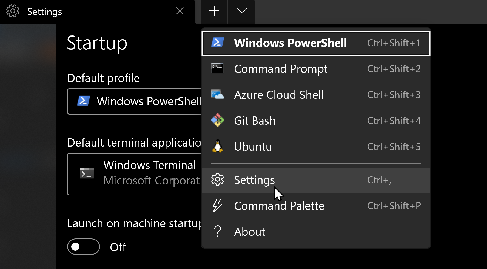
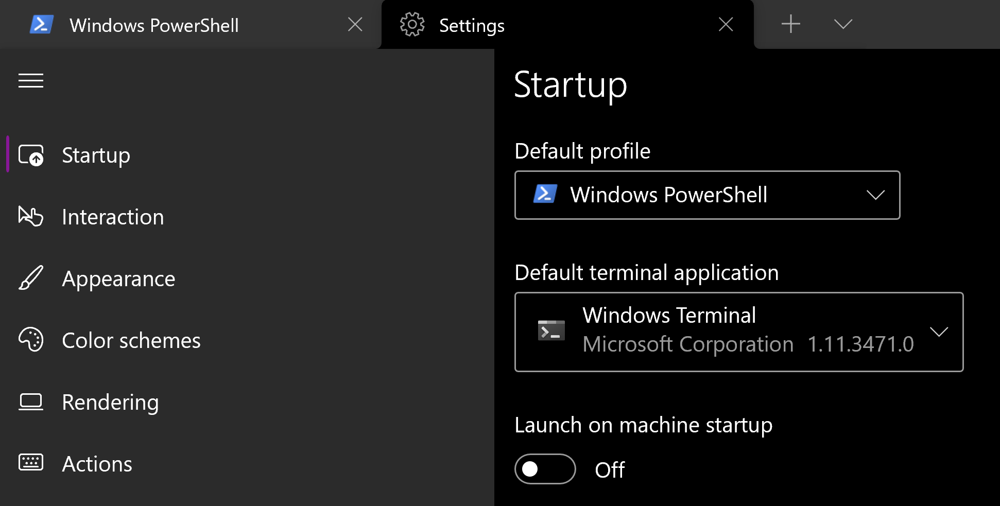

# Settings in microsoft windows terminal

## Where are the microsoft windows terminal settings?

You can select them from the drop down arrow in the row of tabs at the top of the terminal.

## Settings you should set in microsoft windows terminal

These are good settings to set in Windows Terminal.

- First, choose which profile use when Windows Terminal is started, or any other time the `Default profile` is requested. I use `PowerShell` you can use anything you want.
- Next you want to make sure that Windows considers Windows Terminal to be the `Default terminal application`, instead of retro museum and not ghastly and old like the `Windows Console Host` (`conhost.exe`).

