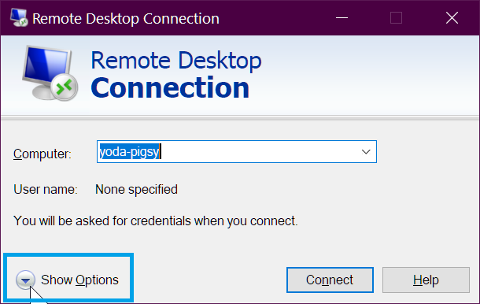
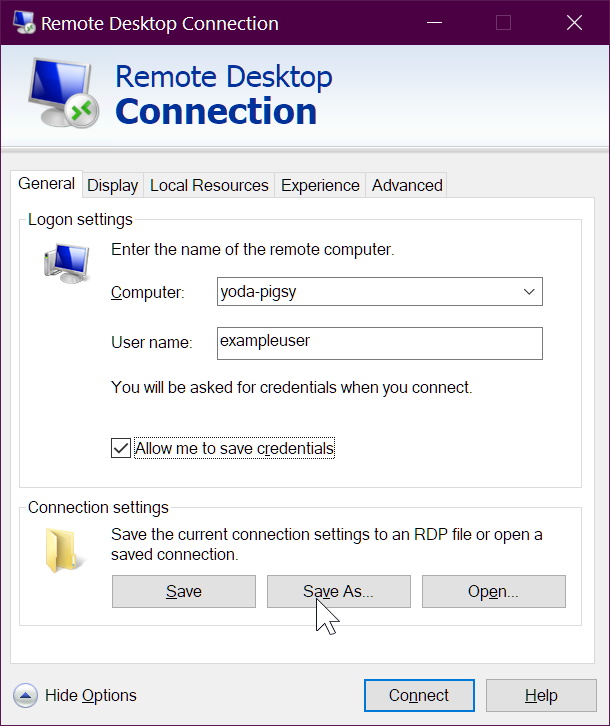
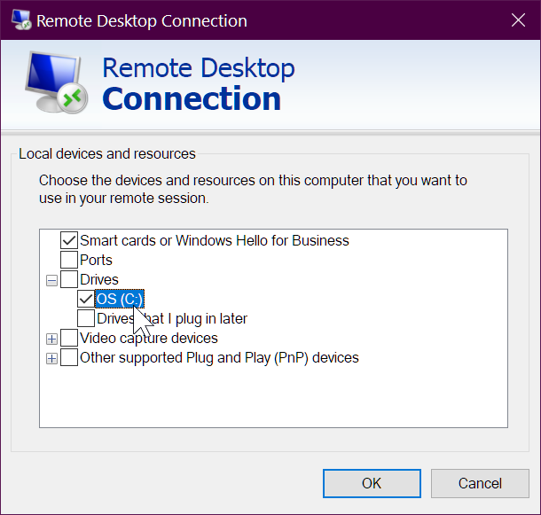
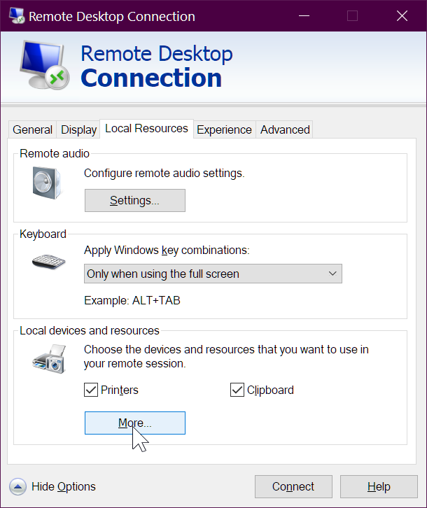

# How to best configure and use mstsc.exe - microsoft terminal services client

"remote desktop connection" (`mstsc.exe`) is very programmable.

In addition to all of the commandline options (see [below](#Command-line-options)) you can save your config as a ".rdp" file (and alter the file if you wish) -- and "run" the rdp file, any time.

It's super easy -

Hit 'show options'

...then "save as"

...and save your `.rdp` file.

-- BUT BEFORE YOU DO THAT -- make sure you've configured it the way you want:

...then save it!

And what does the `Default.RDP` file look like??? It's plain text and very easy to read!

Here's the content of the file I created in those screenshots....

	screen mode id:i:2
	use multimon:i:0
	desktopwidth:i:1920
	desktopheight:i:1080
	session bpp:i:32
	winposstr:s:0,3,0,0,800,600
	compression:i:1
	keyboardhook:i:2
	audiocapturemode:i:0
	videoplaybackmode:i:1
	connection type:i:7
	networkautodetect:i:1
	bandwidthautodetect:i:1
	displayconnectionbar:i:1
	enableworkspacereconnect:i:0
	disable wallpaper:i:0
	allow font smoothing:i:0
	allow desktop composition:i:0
	disable full window drag:i:1
	disable menu anims:i:1
	disable themes:i:0
	disable cursor setting:i:0
	bitmapcachepersistenable:i:1
	full address:s:yoda-pigsy
	audiomode:i:0
	redirectprinters:i:1
	redirectcomports:i:0
	redirectsmartcards:i:1
	redirectclipboard:i:1
	redirectposdevices:i:0
	autoreconnection enabled:i:1
	authentication level:i:2
	prompt for credentials:i:0
	negotiate security layer:i:1
	remoteapplicationmode:i:0
	alternate shell:s:
	shell working directory:s:
	gatewayhostname:s:
	gatewayusagemethod:i:4
	gatewaycredentialssource:i:4
	gatewayprofileusagemethod:i:0
	promptcredentialonce:i:0
	gatewaybrokeringtype:i:0
	use redirection server name:i:0
	rdgiskdcproxy:i:0
	kdcproxyname:s:
	username:s:exampleuser
	drivestoredirect:s:

Entering a machine-name, username and those settings only influenced three lines in the file:

	full address:s:yoda-pigsy

and the last two lines...

	username:s:exampleuser
	drivestoredirect:s:

The file is so easy to change... if you have a dozen machines you need to remote onto, just generate the files!

## Command line options

Here's the full command line options....

	[Window Title]
	Remote Desktop Connection Usage

	[Content]
	MSTSC [<connection file>] [/v:<server[:port]>] [/g:<gateway>] [/admin] [/f[ullscreen]] [/w:<width> /h:<height>] [/public] | [/span] [/multimon] [/edit "connection file"] [/restrictedAdmin] [/remoteGuard] [/prompt] [/shadow:<sessionID> [/control] [/noConsentPrompt]]

	"connection file" -- Specifies the name of an .RDP file for the connection.

	/v:<server[:port]> -- Specifies the remote PC to which you want to connect.

	/g:<gateway> -- Specifies the RD Gateway server to use for the connection. This parameter is only read if the endpoint remote PC is specified with /v.

	/admin -- Connects you to the session for administering a remote PC.

	/f -- Starts Remote Desktop in full-screen mode.

	/w:<width> -- Specifies the width of the Remote Desktop window.

	/h:<height> -- Specifies the height of the Remote Desktop window.

	/public -- Runs Remote Desktop in public mode.

	/span -- Matches the remote desktop width and height with the local virtual desktop, spanning across multiple monitors, if necessary. To span across monitors, the monitors must be arranged to form a rectangle.

	/multimon -- Configures the Remote Desktop Services session monitor layout to be identical to the current client-side configuration.

	/edit -- Opens the specified .RDP connection file for editing.

	/restrictedAdmin -- Connects you to the remote PC in Restricted Administration mode. In this mode, credentials won't be sent to the remote PC, which can protect you if you connect to a PC that has been compromised. However, connections made from the remote PC might not be authenticated by other PCs, which might impact application functionality and compatibility. This parameter implies /admin.

	/remoteGuard -- Connects your device to a remote device using Remote Guard. Remote Guard prevents credentials from being sent to the remote PC, which can help protect your credentials if you connect to a remote PC that has been compromised. Unlike Restricted Administration mode, Remote Guard also supports connections made from the remote PC by redirecting all requests back to your device.

	/prompt -- Prompts you for your credentials when you connect to the remote PC.

	/shadow:<sessionID> -- Specifies the ID of the session to shadow.

	/control -- Allows control of the session when shadowing.

	/noConsentPrompt -- Allows shadowing without user consent.

	[OK]

## See also

- [Use mstsc.exe to connect, receive Black screen](../windows/mstsc_black_screen.md)
- [Terminal services client, without a mouse](../windows/mstsc_without_mouse.md)
