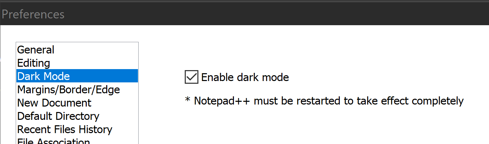

# Dark Theme in Notepad++

You can set a dark theme for the editing experience itself using `Settings > Style Configurator > Select Theme > Zenburn`

On windows, this theme is stored in:

	%appdata%\Notepad++\themes\Zenburn.xml

i.e.

	$env:appdata\Notepad++\themes\Zenburn.xml

Here is an alternative:

- [Dracula Theme](https://draculatheme.com/notepad-plus-plus/)

Download `dracula.xml` from there and then....

- Go to `$env:AppData\Notepad++\themes`
- Place `Dracula.xml` inside that folder
- Restart `Notepad++`
- Dracula will be available in `Settings > Style Configurator`

## Markdown files will now look terrible

(Background will be dark, apart from text where words will have light background. Current line has black background and dark gray text.... almost unreadable)

Install better [markdown support in notepad++](markdown_in_notepad.md), that supports the zenburn theme!

## The application itself NOW supports dark theme

Previously -- the menu system and the chrome of `NotePad++` did not support dark mode.

There is now a "Dark Theme" section in "Preferences" (under Settings in the menu) -- with one checkbox for "Dark mode"

## See also

* [Markdown in Notepad++](markdown_in_notepad.md)
