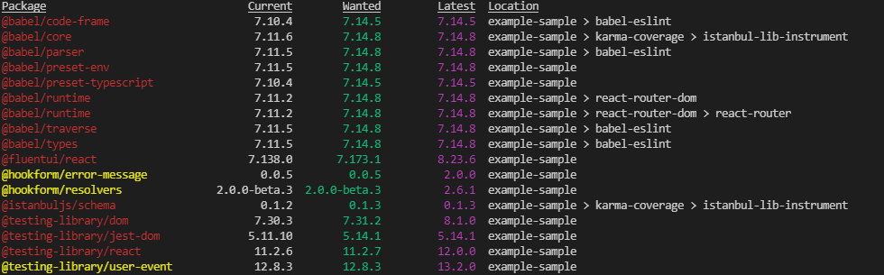

# Find outpated npm packages with 'npm outdated'

From the folder which contains your `package.json` file, you can find out of date local packages like this:

	npm outdated

It gives very nice output, imo.

...and to ask it to look deeper, you can use for example...

	npm outdated --depth 3

(In the screenshot above I've specifid a depth, which is why you can see a dependency chain on the right hand side)

To look for outdated **global** packages, supply a `-g` parameter:

	npm uninstall browser-sync --save-dev
	npm install browser-sync --save-dev

## See also

- [How to update npm?](update_npm.md)
