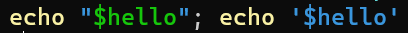

# An issue with Powershell Tokenize

I am trying to use `[System.Management.Automation.PSParser]::Tokenize` to syntax highlight some code.

But I have a problem!

First a simple case (that works ok)

Consider this line of code:

	echo "hello"

What tokens does it have? We can find out like this:

	[System.Management.Automation.PSParser]::Tokenize('echo "hello"', [ref]$null) | Format-Table;

...which produces this table.

```plaintext
Content    Type Start Length StartLine StartColumn EndLine EndColumn
-------    ---- ----- ------ --------- ----------- ------- ---------
echo    Command     0      4         1           1       1         5
hello    String     5      7         1           6       1        13
```

That's awesome. It is the `Command` `echo` followed by the `String` `hello`.

But I am confused by the next example.

Consider these two lines of code:

	echo "$hello"; echo '$hello'

These are similar but *different*.

They are both 'echo' Command followed by a String. But the `$hello` is very different between the two examples.

- In the first line, the `$hello` is a variable inside the string, and it will be interpolated.
- In the second line, the `$hello` is a literal string: it is not interpolated.

If you paste those two lines into a Powershell console you'll see that the `$hello` is syntax highlighted differently in each case.



Now look at what happens when we tokenize them...

	[System.Management.Automation.PSParser]::Tokenize('echo "$hello"', [ref]$null) | Format-Table;
	[System.Management.Automation.PSParser]::Tokenize("echo '`$hello'", [ref]$null) | Format-Table;

They both produce the same tokens, with the same content.

```plaintext
Content    Type Start Length StartLine StartColumn EndLine EndColumn
-------    ---- ----- ------ --------- ----------- ------- ---------
echo    Command     0      4         1           1       1         5
$hello   String     5      8         1           6       1        14
```

If we try to write our own syntax highlighter, how do we know to highlight the two strings differently?

## Answer, thanks to Lee Holmes and Doug Finke

Lee --

> You'll have to use the V3 API:
>
> $tokens = @()
> $errors = @()
> [System.Management.Automation.Language.Parser]::ParseInput('echo "$hello"; echo ''$hello''', [ref] $tokens, [ref] $errors)
>
> [@Lee_Holmes](https://twitter.com/Lee_Holmes/status/1303685263806181380?s=20)

and Doug --

> The "same" as `{'echo "$hello"; echo ''$hello'''}.ast` ?
>
> [@dfinke](https://twitter.com/dfinke/status/1303687569968857091?s=20)

## Using the newer V3 API

	[System.Management.Automation.Language.Parser]::ParseInput('echo "$hello"', [ref] $tokens, [ref] $errors) | out-null;
	$tokens | format-table

Gives...

```plaintext
Text             TokenFlags             Kind HasError Extent
----             ----------             ---- -------- ------
echo            CommandName       Identifier    False echo
"$hello" ParseModeInvariant StringExpandable    False "$hello"
         ParseModeInvariant       EndOfInput    False
```

Whereas,

	[System.Management.Automation.Language.Parser]::ParseInput("echo '`$hello'", [ref] $tokens, [ref] $errors); | out-null;
	$tokens | format-table

Gives:

```plaintext
Text             TokenFlags          Kind HasError Extent
----             ----------          ---- -------- ------
echo            CommandName    Identifier    False echo
'$hello' ParseModeInvariant StringLiteral    False '$hello'
         ParseModeInvariant    EndOfInput    False
```

Note that "ParseInput" directly returns an Abstract Syntax Tree (which is more than I need for this exercise, but super useful when you do need it.) and the `$tokens` variable is a reference to an array of Tokens

## PSToken versus Language.Token

What sort of tokens are these?

Here's there Assembly Qualified Name:

	System.Management.Automation.Language.Token, System.Management.Automation, Version=3.0.0.0, Culture=neutral, PublicKeyToken=31bf3856ad364e35

Whereas my earlier code was return an array of PSToken -- this type:

	System.Management.Automation.PSToken, System.Management.Automation, Version=3.0.0.0, Culture=neutral, PublicKeyToken=31bf3856ad364e35

(I wonder if they're related at all though? Is the full token info hidden inside the PSToken in any way?)

While on the topic of AST's -- Doug points out you can do this:

	{echo "$hello"; echo '$hello'}.ast

And directly access the `AST`.

`todo`: use this in [`.ok`](https://github.com/secretGeek/ok-ps) syntax highlighter!

<!-- markdownlint-disable-file MD046 -->