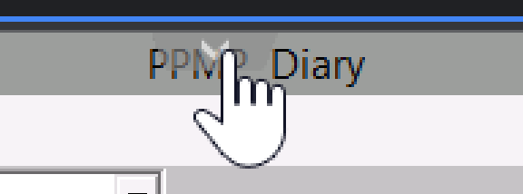
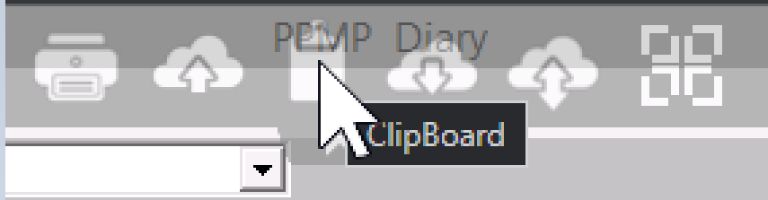
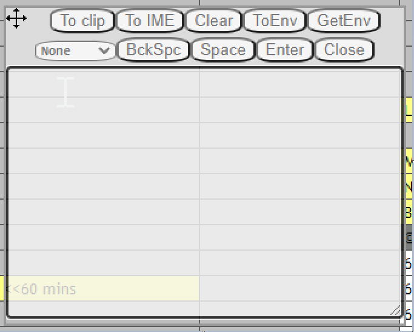
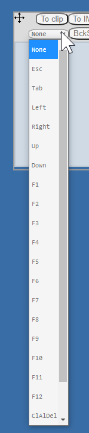

# Solved: How to paste into PPMP when using a Mac

## TL/DR

In MacOS, when using PPMP Cloud edition, you can paste by using `cmd` + `v` -- but here's the trick: you must use your **right** `cmd` button.

## Copy Paste with PPMP on a Mac

PPMP is "Physiotherapy Practice Management Program". The Cloud edition uses an 'in-browser' virtual machine technology call "tsplus.net" (terminal services plus) to present a virtual machine in a browser.

Here is their guide to doing copy/paste from Mac:

> 1. To paste clipboard text data to session use Ctrl + V, this works mostly on all browsers, on Mac browsers Ctrl button has no effect, there you must use it with Right_CMD + V  (left_cmd button not accepted!)

https://support.tsplus.net/support/solutions/articles/44000038518-html5-is-it-possible-to-access-clipboard-copy-paste-

...So on Mac browsers:

Use the *right* "cmd" button, plus "v", to paste.

## ClipBoard tool

One other thing I found -- and maybe others have seen this -- is that there's a few tools that you can get to by clicking the little arrow in the middle of the screen at the top.

When you click that "down" arrow -- it reveals a menu with 6 icons.

- "Print (Ctrl P)"
- "Upload from PC to Server"
- "ClipBoard" (sic)
- "Download From Server to PC"
- "File Manager" and 
- "Full screen"

If you click the third one, "ClipBoard" -- it brings up a funny little applet for doing some clipboard and keyboard operations.

Also -- if your keyboard won't insert some particular keystroke into the PPMP virtual desktop browser -- then the dropdown list in this applet can be used to send those key strokes.

## Sources

- [HTML5 copy / paste - right-click paste doesn't work : TSplus Helpdesk](https://support.tsplus.net/support/solutions/articles/44001811873-html5-copy-paste-right-click-paste-doesn-t-work)
- [What is difference between "To IME" and "To clip" : TSplus Helpdesk](https://support.tsplus.net/support/solutions/articles/44001918178-what-is-difference-between-to-ime-and-to-clip-)
- [Copy/Paste using HTML5 with Mac browsers not working - Terminal Service Plus](https://forum.tsplus.net/forum/viewtopic.php?t=3555)
