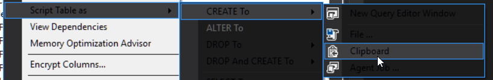

# SSMS Dark Mode in SQL Server Management Studio

In SQl Server management studio you can enable the hidden Dark Mode.

Caveats -- it's not great. A few things are not themed, and some menus have black text on gray background.

Before applying the registry hack:

	Tools -> Options -> General -> the only two color themes available are Blue and Light.

Find the folder SSMS is running from, e.g.

|Version    | Example Location    |
|===========|===========|
| SSMS 2016 | `C:\Program Files (x86)\Microsoft SQL Server\130\Tools\Binn\ManagementStudio` | 
| SSMS 17   | `C:\Program Files (x86)\Microsoft SQL Server\140\Tools\Binn\ManagementStudio` |

(Basically got to `C:\Program Files (x86)\Microsoft SQL Server\` and find the biggest number, go into it, then look in  `Tools\Binn\ManagementStudio` ... or right click your SSMS to see where it's launched)

**As administrator** Edit the file `ssms.pkgundef`

 - Look for the line `// Remove Dark Theme` 
 - The very next line needs to be commented out! Put `//` at the start of the line, to comment it out.
 
 Restart SSMS.
 
 Go to:
 
	Tools -> Options -> General -> Color themes

Available theme now includes Blue, **DARK** and Light.
 

## Source(s)
- [How to enable dark theme in SQL Server Management Studio](https://www.prajwaldesai.com/how-to-enable-dark-theme-in-sql-server-management-studio/) -- this is the one i used

- [Setting up the dark theme in SQL Server Management Studio](https://www.sqlshack.com/setting-up-the-dark-theme-in-sql-server-management-studio/) -- this is one i didn't use but it may be useful if/when upgrades break it

## See also

- [SSMS Dark Mode](../sql_server/SSMS_Dark_Mode.md)