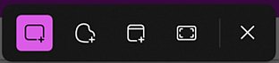
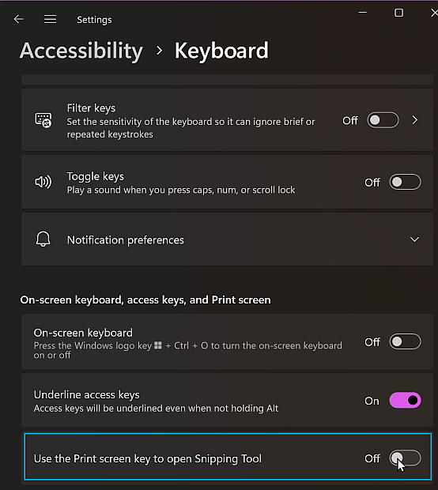

# Snipping Tool is suddenly my default print screen tool?

I assume this happened due to a recent windows update, but suddenly when I took screenshots, Greenshot, my preferred screenshot tool was *not* being used -- but some other weird little toolbar was popping up.

I didn't even know the name of the app that was doing this -- so had trouble knowing how to fix it.

I had to use [TimeSnapper](https://TimeSnapper.com) to work out the name of the currently active program during an attempted screenshot. It was "ScreenClippingHost.exe" ... and research showed that this is part of windows, and related to their "Snipping Tool".

From there I found a Windows setting, which I know I didn't turn on, called "Use the Print screen key to open Snipping Tool"

I had to turn that off -- and then restart Greenshot, before Greenshot would again be in charge of taking screenshots.

## External references

- [Greenshot](https://getgreenshot.org/)
- [TimeSnapper](https://timesnapper.com/)

## See also

- [Need to include the mouse cursor/pointer in a screenshot?](screenshot_with_mouse_cursor.md)
- [How to press the Print Screen key on a MacBook Air (running Windows)](../macbook_air/print_screen.md)
