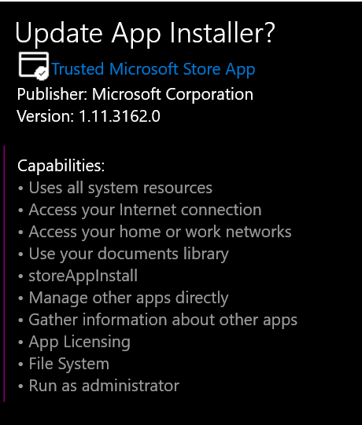

# Getting Started with Winget

I tried to use [winget](https://docs.microsoft.com/en-us/windows/package-manager/) to install [Github cli](../github/github_cli.md) but found I don't have it...

	> winget install GitHub.cli

	winget : The term 'winget' is not recognized as the name of a cmdlet, function, script file, or operable program.

## How to get winget?

From May 2020:

> Since WinGet is open source, you can clone, build, run, and test the code from the GitHub repository (https://github.com/microsoft/winget-cli).
>
> You can also become a Windows Insider an join the Windows Package Manager Insider program by sending your Microsoft Account (MSA) to <winget-feedback@microsoft.com> and request to be included in the preview
>
> [Thomas Maurer - how to install winget](https://www.thomasmaurer.ch/2020/05/how-to-install-winget-windows-package-manager/)

Ah, but this `tip` from October 2020 gives extra options...

> There are several ways to install the winget tool:
>
> The winget tool is included in the flight or preview version of [Windows App Installer](https://www.microsoft.com/p/app-installer/9nblggh4nns1?ocid=9nblggh4nns1_ORSEARCH_Bing&rtc=1&activetab=pivot:overviewtab). You must install the **preview** version of App Installer to use winget. To gain early access, submit your request to the [Windows Package Manager Insiders Program](https://aka.ms/AppInstaller_InsiderProgram). Participating in the flight ring will guarantee you see the latest preview updates.
>
> Participate in the [Windows Insider flight ring](https://insider.windows.com/).
>
> ==Install the Windows Desktop App Installer package located on the [Releases page for the winget repository](https://github.com/microsoft/winget-cli/releases)==.
>
> &mdash; [MS Docs: Install winget](https://docs.microsoft.com/en-us/windows/package-manager/winget/#install-winget)
https://docs.microsoft.com/en-us/windows/package-manager/winget/

So in March 2021 my best option is to go here: https://github.com/microsoft/winget-cli/releases - scroll down to the latest release... download the '.appxbundle' file -- and run that file.

(An `.appxbundle` file is a `UWP` program... they're normally installed via the Microsoft Store, but you can also side load them as I'm doing here.)

Looking in the microsoft store, before I install this package, it says I already have "App Installer" from Microsoft Corporation, and that this app allows me to sideload apps. But it says the release date is "15 April 2016"

When I go to install this downloaded bundle file I am asked if I want to "update" the App Installer program...

Now, in a new windows terminal, not running as admin, I attempt to use winget, and I **succeed**.

	winget install GitHub.cli

Here's the output (there was also a permissions prompt)

	> winget install GitHub.cli
	Found GitHub CLI [GitHub.cli]
	This application is licensed to you by its owner.
	Microsoft is not responsible for, nor does it grant any licences to, third-party packages.
	Downloading https://github.com/cli/cli/releases/download/v1.7.0/gh_1.7.0_windows_amd64.msi
		██████████████████████████████  6.44 MB / 6.44 MB
	Successfully verified installer hash
	Starting package install...
	Successfully installed

## How to use winget

And a brief guide to using winget from that same blogpost by Thomas:

### Search for available packages:

	winget search APPLICATION

### Display information about the packages

	winget show APPLICATION

### Install packages

	winget install APPLICATION

### Manage sources for packages

	winget source (add/list/update/remove/reset)

## External references

- [Winget: documentation](https://docs.microsoft.com/en-us/windows/package-manager/)
- [Hanselman: github command line](https://www.hanselman.com/blog/dont-forget-about-the-github-command-line)
- [Thomas Maurer - how to install winget](https://www.thomasmaurer.ch/2020/05/how-to-install-winget-windows-package-manager/)

## See also

- [Github cli](../github/github_cli.md)
